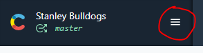
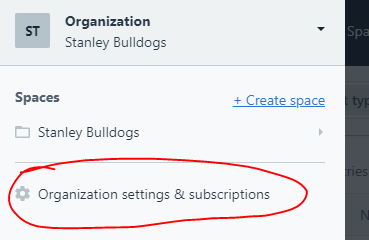
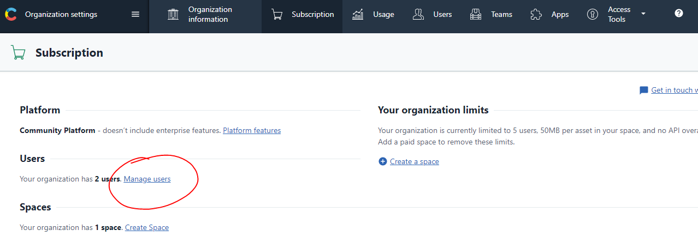
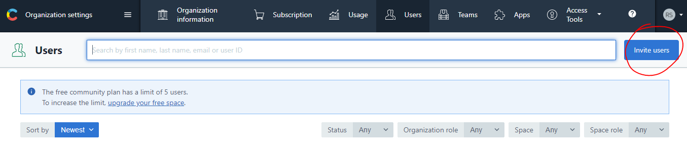
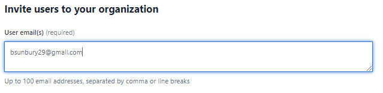
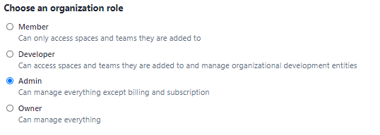
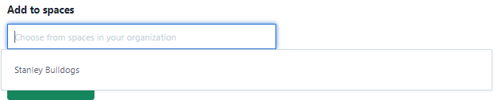
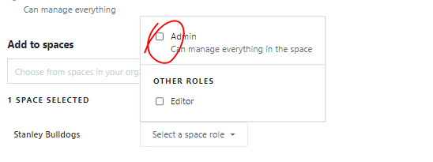

# gatsby-contentful-starter

## Getting started (development)
1. `gatsby new <your-project-name> https://github.com/srianbury/gatsby-contentful-starter.git`
2. `cd <your-project-name>`
3. Place your API keys in `.env.development` and `.env.production`
3. `gatsby develop`

## Getting started (Contentful setup)
1. [Sign up](https://www.contentful.com/sign-up/) for Contentful
2. Adding me as a collaborator:
  a. Menu > Organization settings & subscriptions
  
  
  b. Manage users
  
  c. Invite users
  
  d i.
  Enter my email (bsunbury29@gmail.com)
  
  d ii.
  Select Admin
  
  d iii.
  Select your space (there should just be one option)
  
  d iv.
  Select Admin again
  
  d v.
  Send Invitation!

